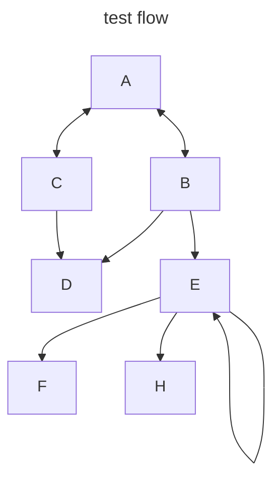
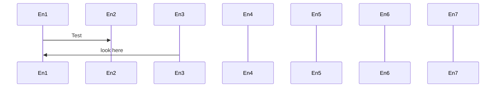

# My Develop platform
*
* Uses vundle to install my plugins, see wiki 
* tmux 
* clang-format

# WLS2

Late have started playing with Ubuntu 20.04 using WSL2, not bad (even for Microsoft)

## Good
  - can asscess home directory with `File Explorer` via `\\wsl$\Ubuntu-20.04\${USER}\`

## Bad 

  - _${PATH}_ shows windows directories, where a lot of windows executable reside
  - Do not like the command line interface, access linux via a windows command window does not feel natural [MobaXterm](https://mobaxterm.mobatek.net/) gives a more natural experience

